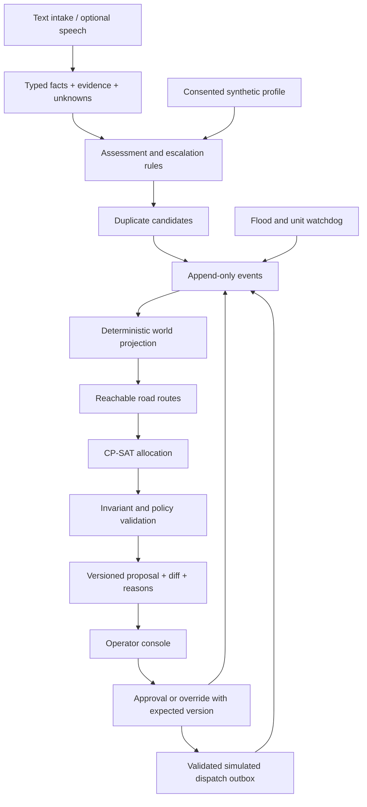

# Architecture

Finalized by CC-01. Binding semantics live in the [decision records](decisions/README.md); where this overview and a decision record differ, the decision record wins.

## Boundaries

- `backend/app/domain/`: entities, rules and pure state transitions; no network calls.
- `backend/app/storage/`: SQLite event store, projection/replay, separate profile store.
- `backend/app/planning/`: affected set, locks, solver, diff, policy gate, reason facts.
- `backend/app/routing/`: provider interface, cached fixtures, route/closure validation.
- `backend/app/intake/`: structured extraction, question policy, template and optional model adapters.
- `backend/app/api/`: FastAPI endpoints and WebSocket event delivery.
- `frontend/`: operator console; consumes generated types, owns no allocation policy.
- `contracts/`: schemas/examples and API contract generation; one canonical definition.
- `evals/`: seeds, expected invariants, baseline and evidence reports.

These are target directories; CC-02 creates the executable scaffold and locks dependencies.

## State and concurrency

Event envelope: schema version, event ID, session ID, gapless global sequence, aggregate, event type, UTC timestamp, simulation time, actor, correlation/causation IDs, idempotency key, `affects_planning` and payload ([0005](decisions/0005-plan-lifecycle-approval-and-replay.md)). Order by sequence; wall clock is informational. Plans bind to the *planning sequence* (latest planning-relevant event) so non-planning audit events and raw position telemetry do not invalidate approvals; positions enter planning through one global 10 s planning tick. Every command carries `expected_session_id`, and idempotency receipts survive demo resets.

Plan envelope: plan ID/version, based-on planning sequence, policy version, assignments, facility allocations, unmet needs with bridge candidates, flags with `requires_ack`, diff against the approved plan, reason facts and solver status/timing. Proposal, approval and simulated dispatch are separate states and events. Approval and override check plan version and planning sequence in one `BEGIN IMMEDIATE` transaction; the simulated outbox uses session-qualified keys with desired-revision fencing, so replay, retries, racing workers and post-approval breakdowns never produce a duplicate or obsolete dispatch.

The server is authoritative. WebSocket clients detect sequence gaps and request a snapshot plus subsequent events. Store typed evidence for explanations; free-form model text never becomes an event command.

## Solver design checkpoints

Lexicographic integer objective solved in passes ([0003](decisions/0003-allocation-objective-als-and-reserve.md)): unmet critical, high, medium and low demand quanta first, then waiting cost, then operating cost. Hard: membership, availability, type, one task per unit, reachability, capacity, locks (on scene, transporting, or ≤ 120 s from arrival) and accepted overrides. Operating cost: severity-weighted travel, reassignment, reserve shortfall and ALS-on-BLS use. Because tiers are fixed only once proven optimal, reserve or travel can never cause extra unmet demand while higher tiers are equal; a timed-out pass is reported as incomplete, not optimal.

ALS shortage stays explicit with a `critical` acknowledgement flag. A BLS bridge exists only as an operator override, has `satisfies_need: false` and never removes the ALS flag. Reserve coverage is soft with a `RESERVE_UNCOVERED` flag; a human `hold_unit` override is the only hard reserve. Infeasible operator overrides return `OVERRIDE_CONFLICT`, are recorded as `OverrideRejected`, and never produce an invalid plan ([0004](decisions/0004-overrides-and-conflicts.md)).

For repeatable demos, pin OR-Tools, set a seed/worker policy and use stable tie-breaking. Benchmark solver time separately from routing/network/explanation time. The prototype's latency goal is measured on its declared scenario size and hardware; no city-scale subsecond promise.
