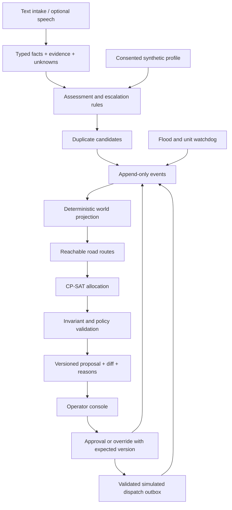

# Proposed architecture to finalize in CC-01

## Boundaries

- `backend/app/domain/`: entities, rules and pure state transitions; no network calls.
- `backend/app/storage/`: SQLite event store, projection/replay, separate profile store.
- `backend/app/planning/`: affected set, locks, solver, diff, policy gate, reason facts.
- `backend/app/routing/`: provider interface, cached fixtures, route/closure validation.
- `backend/app/intake/`: structured extraction, question policy, template and optional model adapters.
- `backend/app/api/`: FastAPI endpoints and WebSocket event delivery.
- `frontend/`: operator console; consumes generated types, owns no allocation policy.
- `contracts/`: schemas/examples and API contract generation; one canonical definition.
- `evals/`: seeds, expected invariants, baseline and evidence reports.

These are target directories; CC-02 creates the executable scaffold and locks dependencies.

## State and concurrency

Event envelope: schema version, unique event ID, aggregate ID, global sequence, UTC timestamp, actor, event type, payload, correlation ID and idempotency key. Use a monotonically increasing sequence for ordering; wall clock alone is not sufficient.

Plan envelope: plan ID/version, based-on event sequence, assignments, unmet needs, policy flags, changes, reason facts and solver status/timing. Persist proposal separately from approved/dispatched state. Version-check approval and override atomically; a new event makes a stale proposal require recomputation. A replay must not send the simulated dispatch twice.

The server is authoritative. WebSocket clients detect sequence gaps and request a snapshot plus subsequent events. Store typed evidence for explanations; free-form model text never becomes an event command.

## Solver design checkpoints

Use integer-scaled objectives, explicit units, a stable simulation clock and stable ordering. Hard constraints: fleet membership, availability, type, one task per unit, reachability, capacity and locks. Soft terms: weighted travel, unmet needs, reassignment and reserve shortfall. State coefficient bounds so a soft travel benefit cannot accidentally outweigh a critical unmet-need penalty.

ALS shortage stays explicit. A separately approved BLS bridge does not satisfy ALS demand. Infeasible operator overrides return a structured conflict; do not create an invalid plan to obey one.

For repeatable demos, pin OR-Tools, set a seed/worker policy and use stable tie-breaking. Benchmark solver time separately from routing/network/explanation time. The prototype's latency goal is measured on its declared scenario size and hardware; no city-scale subsecond promise.
