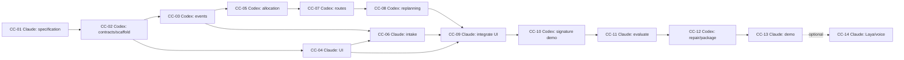

# Claude and Codex handoff workflow

The GitHub issues are the live status source. `docs/tasks.json` is the dependency and acceptance source. `python3 scripts/taskboard.py` joins them. An agent does not know what another chat did unless the result is saved and merged.

## Order of work

| Task | Agent | Starts after | Delivers |
| --- | --- | --- | --- |
| CC-01 | Claude | Now | Final spec, UX states, contract decisions |
| CC-02 | Codex | CC-01 | Runnable skeleton, schemas/types, application CI |
| CC-03 | Codex | CC-02 | Events, world state, API and synthetic seed |
| CC-04 | Claude | CC-02 | Operator UI with contract mocks |
| CC-05 | Codex | CC-03 | Assessment and CP-SAT allocation |
| CC-06 | Claude | CC-03 + CC-04 | Text intake, optional Gemini, fallback explanations |
| CC-07 | Codex | CC-05 | Flood-aware routes and reachability |
| CC-08 | Codex | CC-07 | Replanning, policy, approval, simulated dispatch |
| CC-09 | Claude | CC-04 + CC-06 + CC-08 | Working end-to-end console |
| CC-10 | Codex | CC-09 | Medical ID, duplicate reports, full scenario |
| CC-11 | Claude | CC-10 | Adversarial review and benchmark evidence |
| CC-12 | Codex | CC-11 | Fixes, verified package and runbook |
| CC-13 | Claude | CC-12 | Demo narrative and acceptance |
| CC-14 | Claude | CC-13 | Optional Laya and speech experiments |



CC-03 and CC-04 can run in parallel in separate worktrees. Later, CC-06 may overlap Codex's decision-engine lane once its own dependencies finish. Cross-review is bounded work: it need not claim another implementation issue. One writing agent per worktree; shared schema changes go through the contract owner.

## Every task follows this cycle

1. Fetch main and run the live taskboard. Read dependency handoffs and the task acceptance criteria.
2. Claim a ready issue with `status:doing`. Create a branch/worktree. State the paths you own.
3. Implement and run relevant checks. Add `docs/handoffs/CC-NN.md`.
4. Open a PR with `Closes #N`. Add `status:review` to the issue and remove `status:doing`.
5. Ask the other agent to review that commit using the review prompt in START-HERE. The author fixes findings; reviewer confirms the final changed areas.
6. After checks and review, merge through GitHub. This closes the issue as completed. A review-only task completes when its report merges; defects then belong to the explicitly dependent repair task.
7. The handoff action recomputes `status:ready` / `status:blocked` labels and writes the queue to its run summary. Start the next ready task in the appropriate app.

`status:done` requires a completed issue and completed prerequisites. Closing as `not planned` does not unlock successors. Reopening a dependency marks descendants blocked, even if a descendant was previously closed; inspect and repair the workflow rather than hiding the change. The action does not verify review quality or prove implementation completeness: acceptance checks, PR review and merge discipline remain necessary.

## Two worktrees after CC-02

Run from the repository with a clean checkout and current main:

```sh
git fetch origin
git switch main
git pull --ff-only
git worktree add ../crisis-codex -b codex/cc-03-events main
git worktree add ../crisis-claude -b claude/cc-04-console main
```

Open Codex in `../crisis-codex` and Claude Code in `../crisis-claude`. Do not reuse these example branches if they already exist. Each task gets a new branch based on merged dependencies, with the handoff saved in that branch.

## What is automated

- Setup CI checks task graph, instruction files, handoff machinery and tests.
- Issue events and main pushes refresh dependency labels. Only maintained tasks in `.github/task-map.json` are managed; unrelated issues are untouched.
- Status selection does not launch a model, spend an API budget, merge a PR or send messages to teammates.
- Application lint/type/unit/UI checks must be added by CC-02; the setup workflow does not claim to run them today.

Use your existing subscriptions interactively. Fully unattended cross-provider execution would be a separate integration with authentication, spending limits and failure recovery; it is not configured here.

## Human review areas

The source brief suggests Anubhav for frontend/AI, Shrihari for decision engines and Kavyadeep for backend/data. GitHub CODEOWNERS currently names only the authenticated repository owner. Add other users after their handles and repository access are known.
